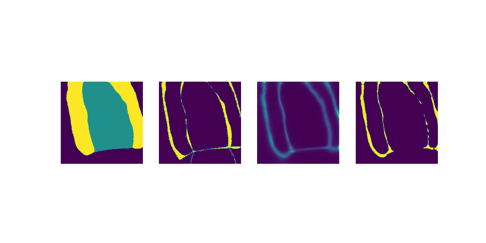

# The Implementation of the Uncertainty Estimation in Medical Image Segmentation


## ✅ Done
<!-- - [x] EDA the CAMUS dataset following the description in the experiment of [CRISP](https://arxiv.org/pdf/2206.07664v1.pdf)
- [x] Developing and training the segmentation model on the CAMUS dataset.
- [x] Modifying the reconstruction model of [BayesCap](https://github.com/ExplainableML/BayesCap) in binary segmentation.
- [x] Applying the same augmentations in [BayesCap](https://github.com/ExplainableML/BayesCap)
- [x] Training the frozen model in multi-class semantic segmentation (BG, LV, MYO)
- [x] Training the bnn model in the normal gaussian distribution
- [x] Solving the negative value of GGD NNL loss for obtaining the sustainable training.
- [x] Developing the uncertainty metrics following the description of [CRISP](https://arxiv.org/pdf/2206.07664v1.pdf)
- [x] Visualize several samples in testing set.
- [x] Developing the VAE model.
- [x] Trainable reconstruction model with VAE. -->
- [x] Experiment a new reconstructon model based on VAE.
- [x] Experiment in concat the input image and yhat in the various scenarios: entrance (topology-aware), attention layers, feature map.
- [x] Training objective of the reconstruction model
```python
final_loss = identity_mapping_loss + NLL_loss + dice_loss
```

## 📋 Todo
- [ ] Customize the forward method segmentation_models.pytorch/segmentation_models_pytorch/base/model.py
- [ ] Applying the concept of teacher-student into frozen-reconstruction networks
- [ ] Setting up the JSRT dataset
- [ ] Experimenting on the various segmentation models
- [ ] Going through the concept of topology-aware

## 💀 Problems
- 
## ⚡ Dependencies
To re-product the project, please refer to the repository

The structure of source code:
```
Segmentation-Uncertainty
|--configs
|--dataset
|--outputs
|--scripts
|--src
|--LICENSE
|--README.md
|--requirements
```
Most of the modules are scripted in the Python language version 3.8. Let’s install the dependencies:
```
pip install -r requirements/native.txt
```
## ⚒️ Quick Start
### Dataset
CAMUS Dataset, the largest publicly-available and fully-annotated dataset for 2D echocardiographic assessment (to our knowledge). The CAMUS dataset contains 2D apical four-chamber and two-chamber view sequences acquired from 500 patients.


Credits: S. Leclerc, E. Smistad, J. Pedrosa, A. Ostvik, et al. "Deep Learning for Segmentation using an Open Large-Scale Dataset in 2D Echocardiography" in IEEE Transactions on Medical Imaging, early acces, 2019

Firstly, please download the original dataset at:

https://www.creatis.insa-lyon.fr/Challenge/camus/


To prepare module to create the dataset which is available for training:
```
python ./src/data_preparation.py -ds camus -s <DOWNLOADED_CAMUS_FOLDER> -d ./dataset/camus
```
the prepared dataset is structured
```
dataset
|-- camus
|   |-- train
|   |   |-- img
|   |   |-- mask
|   |-- val
|   |   |-- img
|   |   |-- mask
|   |-- test
|   |   |-- img
|   |   |-- mask
```

Alternative: a fast way to obtain dataset, directly download from the Kaggle at:

https://www.kaggle.com/datasets/taindp98/camus-lv/

### Training Frozen Model
<!--  -->
Inspired the implementation of BayesCap, we first need to train a segmentation model. We use the baseline of opensource [Python library with Neural Networks for Image Segmentation based on PyTorch](https://github.com/qubvel/segmentation_models.pytorch)

To train the segmentation model, please modify the configurations with your device respectively. For example: 
```
## configs/tmpl.yaml
DATA:
  ROOT: "./dataset/camus"
  IMG_SIZE: 256
  BATCH_SIZE: 1
  NUM_WORKERS: 1
  CLASSES:
    - lv
MODEL:
  ARCH: FPN
  ENCODER: resnet34
  ENCODER_WEIGHTS: imagenet
  FROZEN_CKPT: "./outputs/checkpoint_FPN_efficientnet-b0.pth"
  RECONS_CKPT: "./outputs/checkpoint_recons.pth"
DEVICE: cpu
NUM_EPOCHS: 30
SAVE_DIR: "./outputs"
EVAL_FREQ: 2
```

Then, run the bash script following this command:

```
bash scripts/run_local.sh
```
## 🔥 Experiments
### Segmentation
| Arch | Problem | Encoder | Resolution | Test Dice Score | Checkpoint |
| :---: | :---: | :---: | :---: | :---: | :---: |
| FPN | binary | efficientnet-b0   | 320 | 0.860 | [link](https://mega.nz/file/2slgjS5T#43ZaS831JtAdmv1CTGVqUstQN0GtO4r13IEy8Rr_1Pk)
| FPN | multi-cls | efficientnet-b0   | 320 | 0.926 | [link](https://mega.nz/file/qtUH2JZR#22KrPW9Z_mW70pDCJ5jT-Ul_-RlsNkmKo5mGhN-vlHk)
<!-- ### Reconstruction
| Arch |  Resolution | Test Dice Score | Test Loss | Checkpoint |
| :---:| :---: | :---: | :---: | :---: |
| BayesCap (binary) | 320 | 0.860 | 0.968 | link
| BayesCap (multicls) | 320 | 0.925 | 0.142 | link -->

### Uncertainty Evaluation
The reconstruction network is trained on the training set of CAMUS and is reported on the testing set of CAMUS.
| Method |  Resolution | Correlation 🔼 | ECE 🔽 | MI 🔼|
| :---:| :---: | :---: | :---: | :---: | 
| Entropy | 256 | 0.66 | 0.12 | 0.02 |
| Edge | 256 | 0.64  | 0.06 | 0.05 |
| [CRISP](https://arxiv.org/pdf/2206.07664v1.pdf) | 256 | 0.71  | 0.09 | 0.20 |
| Reproduce Entropy | 256 | 0.5308 | 0.0716 | 0.0293 |
| GaussCap | 256 | 0.2846 | 0.0765 |  0.0375 |
<!-- | BayesCap | 320 | 0.116 | 0.187 | 0.019 |
| GaussCap | 320 | 0.302 | 0.07 | 0.037 |
| GaussCap | 256 | 0.274 | 0.037 | 0.085 | -->

**Note**: Clamping the range of value of uncertainty map in [0,1]

Passing the image into the GaussCap network as a context.

| Method |  Resolution | Correlation 🔼 | ECE 🔽 | MI 🔼|
| :---:| :---: | :---: | :---: | :---: |
| GaussCap | 256 | 0.2846 | 0.0765 |  0.0375 |
| Concat @ entrance | 256 | 0.3395 | 0.0322 | 0.0801 |
| Channel attention | 256 | 0.3770 | 0.0805 | 0.0283 |
| Spatial attention | 256 | 0.3947 | 0.0792 | 0.0285 |
| Concat @ feature map | 256 | 0.3008 | 0.0814 | 0.0169 |
| Teacher-Student (w/o context) | 256 | 0.3588 | 0.0675 | 0.0218 |
| Teacher-Student (Channel attention) | 256 | 0.2963 | 0.0803 | 0.0193 |
<!-- | VAE + Normal Gaussian | 320 | 0.309 | 0.053 | 0.077 |

<!-- ### Visualization
1. BayesCap fashion (Fully Convolutional Network) with the loss function following the normal Gaussian distribution.

| Using only yhat             | Concat in the channel |
:-------------------------:|:-------------------------:
|
|
|
|
| -->

<!-- 2. CRISP fashion (Variational Auto-Encoder) -->


<!-- 

 -->
<!-- 


 -->